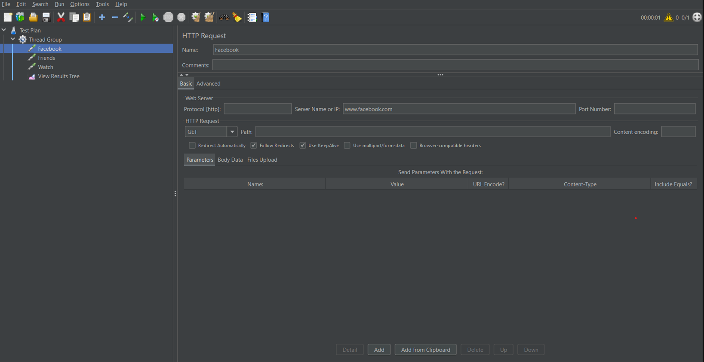
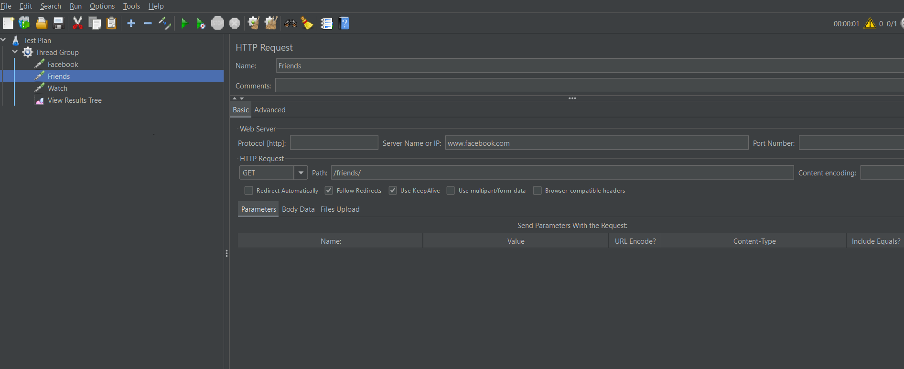
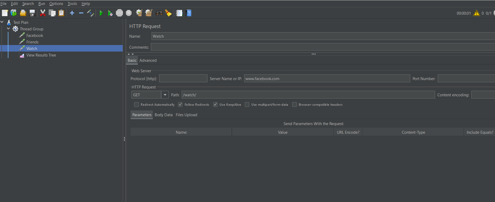
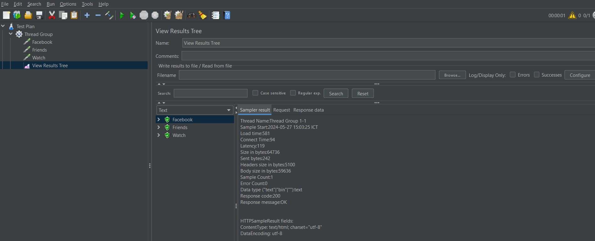
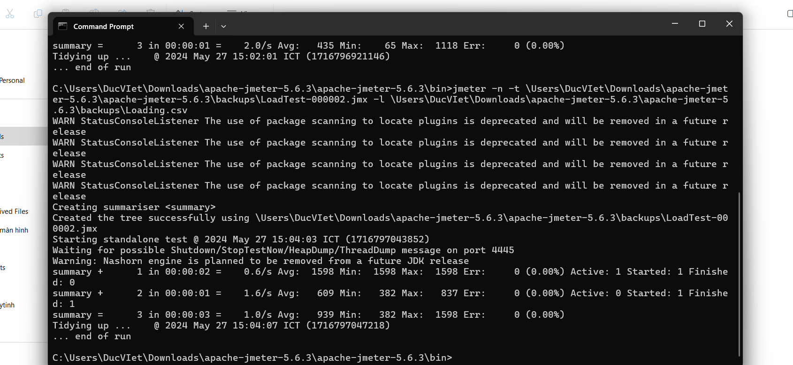
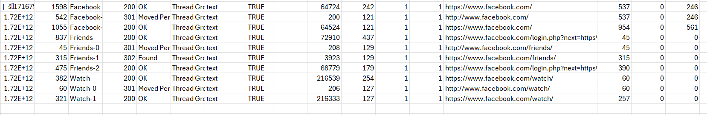
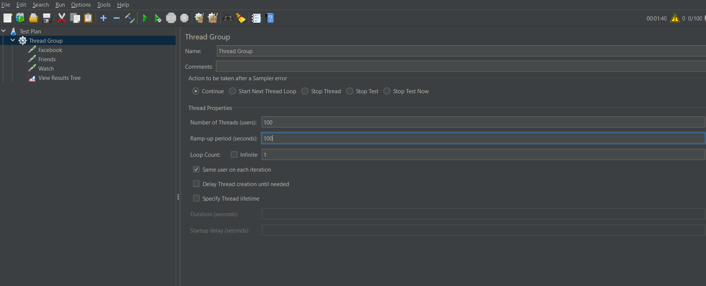
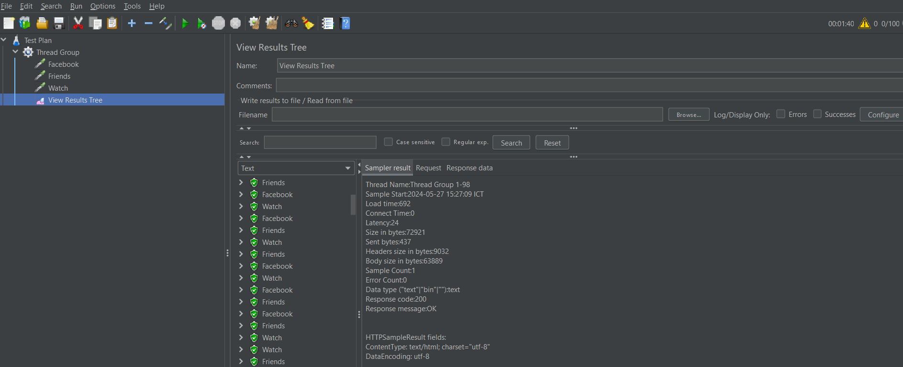
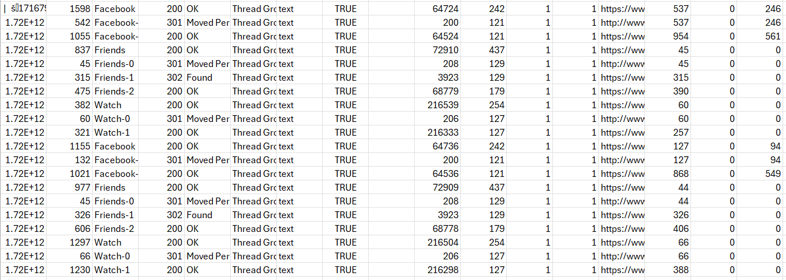

# JMeter-collection-API

Tên Dự Án: JMeter

Ngày Kiểm Thử: 28/05/2024

Người Kiểm Thử: Nguyễn Minh Phương

## Kiểm thử hiệu năng
**Kiểm thử hiệu năng là rất quan trọng, dùng để xác định ứng dụng web của mình có đáp ứng được tải cao hay không. Apache JMeter là một công cụ phổ biến dùng để kiểm thử hiệu năng, nó có một số lợi thế như sau:**
- JMeter có thể được sử dụng để kiểm tra hiệu năng của cả resources tĩnh như JavaScript và HTML, cũng như các resources động như JSP, Servlets và AJAX.
- JMeter có thể cho biết số lượng người dùng đồng thời tối đa mà trang web của bạn có thể xử lý 
- JMeter cung cấp một loạt các phân tích đồ họa của các báo cáo hiệu suất.

**Kiểm thử hiệu năng JMeter bao gồm:**
- Load Testing: Mô phỏng đồng thời nhiều người dùng truy cập một trang Web nào đó.

- Stress Testing: Mỗi máy chủ (server) web có khả năng tải tối đa. Khi tải vượt quá giới hạn, máy chủ sẽ bắt đầu phản hồi chậm và tạo ra lỗi. Mục đích của Stress Testing là tìm chịu tải tối đa mà máy chủ web có thể xử lý.

**thực hiện kiểm tra hiệu năng cho trang web Facebook.com với 100 người dùng: Facebook.com (https://www.facebook.com/)**
- Trang web được lựa chọn sẽ là: https://www.facebook.com/

# Thêm một HTTP Request Sampler

- Thêm 2 trang web khác bao gồm:
  - Trang web thứ nhất: https://www.facebook.com/friends
  
  - Trang web thứ hai: https://www.facebook.com/watch
  

# Thêm một Listener để ghi lại kết quả

- Kết quả khi chạy:

**Đây là chi tiết của kết quả được hiển thị:**

- Thread Name: Tên của nhóm luồng, trong trường hợp này là "Thread Group 1-1".
- Load time: Tổng thời gian thực hiện yêu cầu, là 581 mili giây.
- Connect Time: Thời gian kết nối, là 94 mili giây.
- Size in bytes: Tổng kích thước của phản hồi tính bằng byte, là 64736 byte.
- Sent bytes: Số byte đã gửi, là 242 byte.
- Headers size in bytes: Kích thước của header trong phản hồi, là 5100 byte.
- Body size in bytes: Kích thước của nội dung phản hồi, là 59636 byte.
- Sample Count: Số mẫu đã lấy, là 1.
- Error Count: Số lỗi, là 0.
- Data type: Loại dữ liệu trong phản hồi, là "text".
- Response code: Mã phản hồi HTTP, là 200 (chỉ ra thành công).
- Response message: Thông điệp phản hồi HTTP, là "OK".

# Tạo file Loading.csv để hiển thị thông số

**Thông số trong câu lệnh này bao gồm:**
- Thời gian chạy (time): Tổng thời gian bài kiểm thử đã chạy (00:00:01, 00:00:01, 00:00:03).
- Tốc độ trung bình (avg): Số yêu cầu mỗi giây (2.0/s, 1.6/s, 1.0/s).
- Thời gian nhỏ nhất (min): Thời gian phản hồi nhanh nhất (65 ms, 382 ms).
- Thời gian lớn nhất (max): Thời gian phản hồi chậm nhất (1118 ms, 1598 ms).
- Lỗi (err): Số lượng lỗi (0 lỗi trong cả ba lần).

**Kết quả từng mẫu:**

- Mẫu 1: Thời gian chạy là 00:00:02, tốc độ là 0.6 yêu cầu/giây, thời gian phản hồi nhỏ nhất là 1598 ms, không có lỗi.
- Mẫu 2: Thời gian chạy là 00:00:01, tốc độ là 1.6 yêu cầu/giây, thời gian phản hồi nhỏ nhất là 609 ms, không có lỗi.
- Mẫu 3: Thời gian chạy là 00:00:03, tốc độ là 1.0 yêu cầu/giây, thời gian phản hồi nhỏ nhất là 939 ms, không có lỗi.

# Kết quả hiển thị trong file csv

# Thay đổi cấu hình số lượng người dùng ảo: 
- Thử tăng số lượng người dùng lên: 

- Kết quả:

**Kết quả hiển thị:**
- Thread Name: Tên của nhóm luồng, trong trường hợp này là "Thread Group 1-98". Điều này cho thấy đây là mẫu của luồng thứ 98 trong nhóm luồng.
- Load time: Tổng thời gian thực hiện yêu cầu, là 692 mili giây.
- Connect Time: Thời gian kết nối, là 0 mili giây.
- Latency: Thời gian từ khi gửi yêu cầu đến khi nhận được phản hồi đầu tiên, là 24 mili giây.
- Size in bytes: Tổng kích thước của phản hồi tính bằng byte, là 72921 byte.
- Sent bytes: Số byte đã gửi, là 437 byte.
- Headers size in bytes: Kích thước của header trong phản hồi, là 9032 byte.
- Body size in bytes: Kích thước của nội dung phản hồi, là 63889 byte.
- Sample Count: Số mẫu đã lấy, là 1.
- Error Count: Số lỗi, là 0.
- Data type: Loại dữ liệu trong phản hồi, là "text".
- Response code: Mã phản hồi HTTP, là 200 (chỉ ra thành công).
- Response message: Thông điệp phản hồi HTTP, là "OK".
**Kết luận: Với 100 người dùng, mỗi yêu cầu HTTP được thực hiện thành công với thời gian tải trung bình (692 mili giây) và không có lỗi nào xảy ra. Điều này cho thấy rằng hệ thống của bạn có thể xử lý tốt tải từ 100 người dùng đồng thời mà không gặp sự cố nào đáng kể.**
  
## Theo dõi trong csv:

